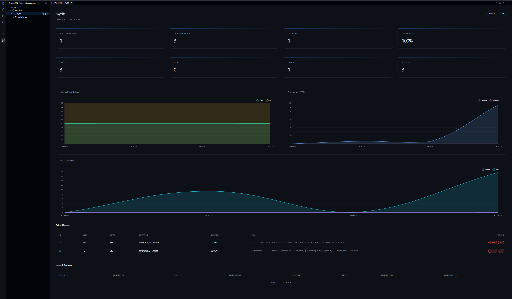
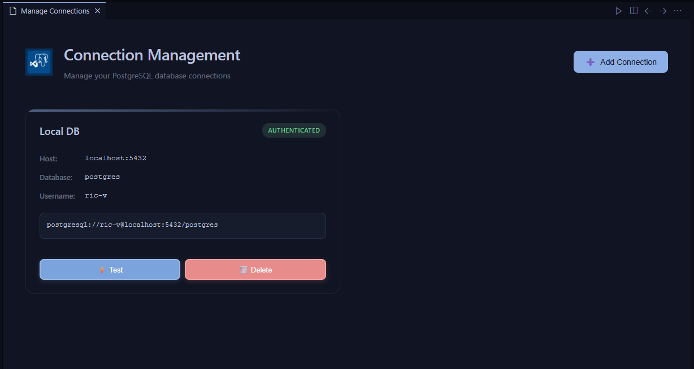
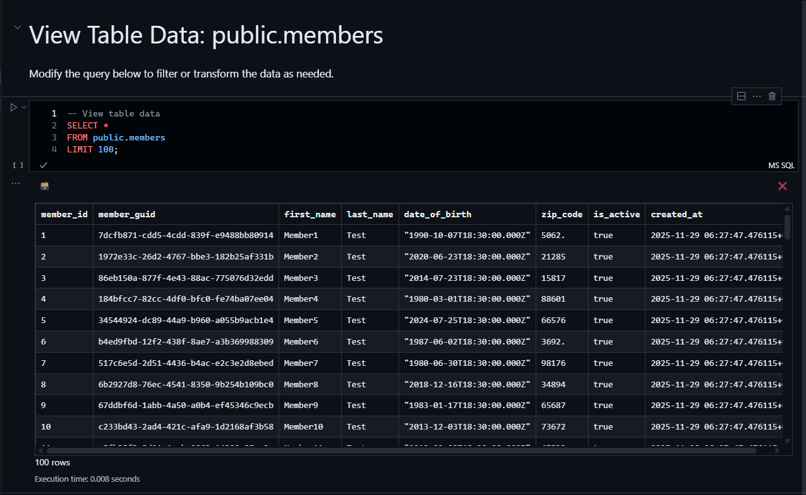
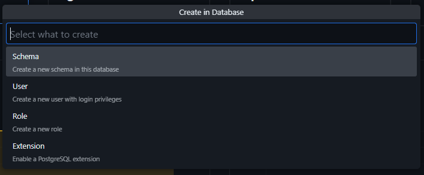

<div align="center">

# 🐘 PostgreSQL Explorer

### *Professional Database Management for VS Code*

[](https://marketplace.visualstudio.com/items?itemName=ric-v.postgres-explorer)
[](https://marketplace.visualstudio.com/items?itemName=ric-v.postgres-explorer)
[](https://marketplace.visualstudio.com/items?itemName=ric-v.postgres-explorer)
[](https://github.com/dev-asterix/yape-postgres-ext-vsc)

**A comprehensive PostgreSQL database management extension featuring interactive SQL notebooks, real-time monitoring dashboard, and advanced database operations—all within VS Code.**

[🚀 Quick Start](#-quick-start) • [📖 Documentation](#-features) • [🤝 Contributing](#-contributing) • [💬 Support](#-support)

</div>

---

## 🎯 **Why PostgreSQL Explorer?**

<table>
<tr>
<td width="50%">

### 🎨 **Modern Interface**
- Beautiful, intuitive UI designed for developers
- Real-time dashboard with live metrics
- Context-aware operations
- Seamless VS Code integration

</td>
<td width="50%">

### ⚡ **Powerful Features**
- Interactive SQL notebooks
- 🤖 AI-powered Copilot & agentic support
- Advanced query management
- Complete CRUD operations
- Database backup & restore

</td>
</tr>
<tr>
<td>

### 🔐 **Secure & Reliable**
- VS Code SecretStorage for credentials
- Safe connection management
- Transaction support
- Data integrity protection

</td>
<td>

### 🚀 **Developer Friendly**
- 🤖 GitHub Copilot integration
- Keyboard shortcuts
- IntelliSense support
- Export to CSV/Excel
- PSQL terminal integration

</td>
</tr>
</table>

---

## 📸 **Preview**

<div align="center">

### 📊 Real-Time Database Dashboard

*Monitor connections, queries, and performance metrics in real-time*

<br>

### 🔗 Connection Management


*Manage multiple database connections with an intuitive interface*

</div>

---

## 📑 **Table of Contents**

<details open>
<summary><b>📚 Click to expand/collapse</b></summary>

- [✨ Features](#-features)
  - [Connection Management](#-connection-management)
  - [Real-Time Dashboard](#-real-time-database-dashboard)
  - [Database Explorer](#-database-explorer)
  - [SQL Notebooks](#-interactive-sql-notebooks)
  - [Object Operations](#-object-operations)
- [🚀 Quick Start](#-quick-start)
- [📖 Usage Guide](#-usage-guide)
- [🎓 Tutorials](#-tutorials)
- [🤝 Contributing](#-contributing)
- [🏗️ Local Development](#-local-development)
- [🔧 Troubleshooting](#-troubleshooting)
- [📫 Support](#-support)

</details>

---

## ✨ **Features**

### 🔌 **Connection Management**

<table>
<tr>
<td width="60%">

**Secure & Flexible Connections**

- 🔐 **Secure Storage**: Passwords encrypted with VS Code SecretStorage API
- 🔄 **Multiple Connections**: Switch between databases effortlessly
- 🎛️ **Visual Dashboard**: Intuitive UI for managing connections
- ⚡ **Quick Toggle**: Connect/disconnect with a single click
- 🏷️ **Custom Names**: Organize connections with friendly labels

</td>
<td width="40%">

```json
{
  "name": "Production DB",
  "host": "db.example.com",
  "port": 5432,
  "username": "admin",
  "database": "myapp"
}
```

</td>
</tr>
</table>

<br>

### 📊 **Real-Time Database Dashboard**

> [!NOTE]
> The dashboard provides live metrics updated in real-time without manual refresh.

<details>
<summary><b>📈 Live Metrics & Monitoring</b> (click to expand)</summary>

| Metric | Description | Actions |
|--------|-------------|---------|
| 🔗 **Active Connections** | Real-time connection count | View connection details |
| 💾 **Database Size** | Current storage usage (MB/GB) | Track growth trends |
| ⚡ **Active Queries** | Running query count | Cancel/Kill queries |
| 🎯 **Cache Hit Ratio** | Cache performance percentage | Optimize performance |

**Performance Graphs:**
- 📈 Connection trends over time
- 🔄 Query activity patterns
- 💾 Memory usage monitoring

**Active Query Management:**
- ✅ View all running queries with execution time
- ❌ Cancel long-running queries safely
- 🛑 Terminate stuck connections
- 📊 Query execution statistics

</details>

<br>

### 🌳 **Database Explorer**

<table>
<tr>
<td>

**Hierarchical Navigation**
```
📁 Connection
└── 🗄️ Database
    └── 📂 Schema
        ├── 📊 Tables
        ├── 👁️ Views
        ├── ⚙️ Functions
        ├── 🏷️ Types
        ├── 🔗 Foreign Tables
        ├── 🧩 Extensions
        └── 👥 Roles
```

</td>
<td>

**Supported Objects**

| Object | Operations |
|--------|-----------|
| 📊 **Tables** | View, Edit, Insert, Update, Delete, Truncate |
| 👁️ **Views** | View Definition, Edit, Query Data |
| 🔄 **Materialized Views** | Refresh, View Data, Edit, Drop |
| ⚙️ **Functions** | View, Edit, Call, Drop |
| 🏷️ **Types** | View Properties, Edit, Drop |
| 🔗 **Foreign Tables** | View, Edit, Drop |
| 🧩 **Extensions** | Enable, Disable, Drop |
| 👥 **Roles** | Grant/Revoke, Edit, Drop |

</td>
</tr>
</table>

<br>

### 📓 **Interactive SQL Notebooks**

<details>
<summary><b>🎯 Notebook Features</b> (click to expand)</summary>

**Create & Execute Queries**

```sql
-- Cell 1: Data Analysis
SELECT 
  date_trunc('day', created_at) as day,
  COUNT(*) as user_count
FROM users
WHERE created_at >= NOW() - INTERVAL '30 days'
GROUP BY day
ORDER BY day;

-- Cell 2: Performance Check
EXPLAIN ANALYZE
SELECT * FROM orders 
WHERE customer_id = 123;
```

**Key Features:**
- ✅ Multi-cell execution
- ⌨️ `Ctrl+Enter` to run cell
- 🤖 **AI-Powered Assistance**: GitHub Copilot & agentic support
- 📊 Rich tabular output
- 🎨 Syntax highlighting
- 💾 Export to CSV/Excel
- 📈 Row count & execution time
- 🔄 Result sorting by column

> [!TIP]
> **AI-Powered SQL Development**: The notebook interface fully supports GitHub Copilot and other agentic AI tools, providing intelligent code completion, query suggestions, and automated SQL generation directly in your notebooks!

</details>

<div align="center">

<p><i>Interactive SQL notebooks with rich output formatting</i></p>
</div>

<br>

### 🛠️ **Object Operations**

<details>
<summary><b>📊 Table Operations</b></summary>

**Data Management**
- ✅ View data with pagination
- ➕ Insert new rows
- ✏️ Update existing data
- 🗑️ Delete rows
- 🧹 Truncate table
- ❌ Drop table

**Structure Management**
- 🔍 View table properties (columns, constraints, indexes)
- ✏️ Edit table definition
- 📋 Show column details with data types
- 🔗 View foreign key relationships

**Script Generation**
```sql
-- Quick script generation
SELECT * FROM employees;                    -- SELECT
INSERT INTO employees (...) VALUES (...);  -- INSERT
UPDATE employees SET ... WHERE ...;        -- UPDATE
DELETE FROM employees WHERE ...;           -- DELETE
CREATE TABLE employees (...);              -- CREATE
```

**Maintenance Tools**
- 🧹 **VACUUM**: Clean up dead rows and reclaim space
- 📊 **ANALYZE**: Update table statistics for query planner
- 🔄 **REINDEX**: Rebuild indexes for optimal performance

</details>

<details>
<summary><b>👁️ View Operations</b></summary>

**Regular Views**
- 📖 View definition display
- ✏️ Edit view SQL
- 🔍 Query view data
- ❌ Drop view

**Materialized Views**
- 🔄 Refresh cached data
- 📊 View current data
- ✏️ Edit definition
- ❌ Drop materialized view

</details>

<details>
<summary><b>⚙️ Function Management</b></summary>

- 📖 View function properties (signature, parameters, return type)
- ✏️ Edit definition (CREATE OR REPLACE)
- ▶️ Call function with parameters
- 📝 View source code
- ❌ Drop function

**Example Function Creation:**
```sql
CREATE OR REPLACE FUNCTION calculate_total(
  item_price DECIMAL,
  quantity INTEGER
)
RETURNS DECIMAL AS $$
BEGIN
  RETURN item_price * quantity;
END;
$$ LANGUAGE plpgsql;
```

</details>

<details>
<summary><b>📂 Schema Operations</b></summary>

**Schema Management**
- 🔍 View schema properties
- ➕ Create objects within schema
- 📜 Generate schema scripts
- 🔧 Schema-level operations

**Quick Object Creation**
| Object Type | Shortcut |
|-------------|----------|
| 📊 Table | Right-click → Create Table |
| 👁️ View | Right-click → Create View |
| 🔄 Materialized View | Right-click → Create Materialized View |
| ⚙️ Function | Right-click → Create Function |
| 🏷️ Type | Right-click → Create Type |
| 🔗 Foreign Table | Right-click → Create Foreign Table |

</details>

<div align="center">

<p><i>Create database objects with intelligent templates</i></p>
</div>

---

## 🚀 **Quick Start**

### 📦 **Installation**

<table>
<tr>
<td width="50%">

**Option 1: VS Code Marketplace**

1. Open VS Code
2. Press `Ctrl+Shift+X`
3. Search for `PostgreSQL Explorer`
4. Click **Install**

</td>
<td width="50%">

**Option 2: Command Line**

```bash
# Install from VSIX
code --install-extension postgres-explorer-*.vsix

# Or using the extension ID
ext install ric-v.postgres-explorer
```

</td>
</tr>
</table>

### 🔗 **First Connection**

> [!TIP]
> Test your connection using `psql` before adding it to the extension.

**Step-by-Step Setup:**

1. **Open Extension**
   - Click the PostgreSQL icon in Activity Bar
   - Or press `Ctrl+Shift+P` → `PostgreSQL: Add Connection`

2. **Enter Connection Details**
   ```
   Connection Name: My Local Database
   Host:           localhost
   Port:           5432
   Username:       postgres
   Password:       ••••••••
   Database:       myapp_dev
   ```

3. **Save & Connect**
   - Click **Save** to store credentials securely
   - Connection appears in explorer
   - Click to connect and start exploring

> [!WARNING]
> Passwords are encrypted and stored securely using VS Code's SecretStorage API.

---

## 📖 **Usage Guide**

### 🧭 **Navigation Basics**

<table>
<tr>
<td width="50%">

**Tree Navigation**
1. 🔍 **Expand Connections** → View databases
2. 📂 **Browse Schemas** → See available schemas
3. 📊 **Explore Objects** → Navigate Tables/Views/Functions
4. 🖱️ **Right-Click** → Access context menus

</td>
<td width="50%">

**Keyboard Shortcuts**
- `F5` - Refresh current item
- `Ctrl+Enter` - Execute query
- `Ctrl+Shift+P` - Command palette
- Right-click - Context operations

</td>
</tr>
</table>

<br>

### 📊 **Working with Tables**

<details open>
<summary><b>🔍 Viewing Table Data</b></summary>

1. Right-click table → **View Table Data**
2. Data opens in new tab with pagination
3. Click column headers to sort
4. Use export buttons for CSV/Excel

**Pro Tip:** Double-click table for quick data view

</details>

<details>
<summary><b>✏️ Editing Table Structure</b></summary>

1. Right-click table → **Show Table Properties**
2. Review columns, constraints, indexes
3. Select **Edit Table Definition** to modify
4. Make changes in SQL editor
5. Execute to apply

**Example Modification:**
```sql
ALTER TABLE employees
ADD COLUMN department VARCHAR(100),
ADD COLUMN hire_date DATE DEFAULT CURRENT_DATE;
```

</details>

<details>
<summary><b>📜 Generating Scripts</b></summary>

Right-click table → **Scripts** → Choose type:

| Script Type | Use Case |
|-------------|----------|
| 📋 SELECT | Query template with all columns |
| ➕ INSERT | Insert template with column list |
| ✏️ UPDATE | Update template with WHERE clause |
| 🗑️ DELETE | Delete template with conditions |
| 🏗️ CREATE | Full table definition script |

</details>

<br>

### 📓 **SQL Notebooks Workflow**

> [!NOTE]
> Notebooks support multiple cells for organizing complex queries.

**1. Create Notebook**
```
Right-click database/schema/table → New PostgreSQL Notebook
```

**2. Write Queries**
```sql
-- Cell 1: Setup
CREATE TEMP TABLE report_data AS
SELECT * FROM sales WHERE date >= '2024-01-01';

-- Cell 2: Analysis
SELECT 
  product_category,
  SUM(amount) as total_sales,
  COUNT(*) as order_count
FROM report_data
GROUP BY product_category
ORDER BY total_sales DESC;

-- Cell 3: Cleanup
DROP TABLE report_data;
```

**3. Execute & Export**
- Press `Ctrl+Enter` on each cell
- Review results inline
- Export to CSV/Excel as needed

**4. AI-Powered Assistance 🤖**

> [!NOTE]
> The notebook interface seamlessly integrates with GitHub Copilot and other agentic AI tools for intelligent SQL assistance.

**New in v0.2.3: Enhanced AI Integration**
- ✨ **"Ask AI" CodeLens**: Click the link directly above any SQL query to get instant help.
- 🔘 **Inline Toolbar Button**: Access AI assistance from the cell toolbar.
- 🧠 **Multiple Providers**: Support for **Google Gemini**, **OpenAI**, **Anthropic**, and **GitHub Copilot**.
- ⚡ **Pre-defined Tasks**: Quickly **Explain**, **Fix**, **Optimize**, or **Format** your queries.

**Copilot Features Available:**
- 💡 **Intelligent Code Completion**: Auto-complete SQL queries as you type
- 🔍 **Context-Aware Suggestions**: Get relevant table/column suggestions
- ✨ **Query Generation**: Describe what you want in comments, let AI write the SQL
- 🐛 **Error Detection**: Real-time syntax and logical error detection
- 📝 **Query Optimization**: Suggestions for improving query performance
- 💬 **Natural Language to SQL**: Convert plain English to SQL queries

**Example AI-Assisted Workflow:**
1. Click **"✨ Ask AI"** above your query.
2. Select a task (e.g., "Optimize Query") or type a custom instruction.
3. Watch as the AI transforms your SQL in real-time!

```sql
-- Cell 1: Ask AI to generate a query
-- Create a query to find top 10 customers by total purchase amount in the last month

-- Copilot generates:
SELECT 
  c.customer_id,
  c.name,
  SUM(o.amount) as total_spent
FROM customers c
JOIN orders o ON c.id = o.customer_id
WHERE o.created_at >= NOW() - INTERVAL '30 days'
GROUP BY c.customer_id, c.name
ORDER BY total_spent DESC
LIMIT 10;
```

**Agentic AI Support:**
- 🎯 Multi-step query planning and execution
- 🔄 Automated refactoring and optimization
- 📊 Data analysis suggestions
- 🧪 Test data generation

<br>

### 📊 **Database Dashboard Usage**

Right-click database → **Show Database Dashboard**

**Dashboard Components:**

| Section | Information | Actions |
|---------|-------------|---------|
| 📈 **Metrics Panel** | Connections, Size, Queries, Cache | Real-time updates |
| 📊 **Performance Graphs** | Trends over time | Visual analysis |
| 🔍 **Active Queries** | Running queries with details | Cancel/Kill |

**Managing Active Queries:**

> [!CAUTION]
> Killing queries will terminate the client connection immediately.

1. View query details (SQL, duration, client)
2. **Cancel** - Sends cancellation request (graceful)
3. **Kill** - Terminates connection (forceful)
4. Confirm action in dialog

---

## 🎓 **Tutorials**

<details>
<summary><b>🎯 Tutorial 1: Creating a Complete Database Schema</b></summary>

**Goal:** Create a blog database with tables, views, and functions

**Step 1: Create Tables**
```sql
-- Users table
CREATE TABLE users (
  id SERIAL PRIMARY KEY,
  username VARCHAR(50) UNIQUE NOT NULL,
  email VARCHAR(255) UNIQUE NOT NULL,
  created_at TIMESTAMP DEFAULT NOW()
);

-- Posts table
CREATE TABLE posts (
  id SERIAL PRIMARY KEY,
  user_id INTEGER REFERENCES users(id) ON DELETE CASCADE,
  title VARCHAR(200) NOT NULL,
  content TEXT,
  published_at TIMESTAMP,
  created_at TIMESTAMP DEFAULT NOW()
);

-- Comments table
CREATE TABLE comments (
  id SERIAL PRIMARY KEY,
  post_id INTEGER REFERENCES posts(id) ON DELETE CASCADE,
  user_id INTEGER REFERENCES users(id) ON DELETE CASCADE,
  content TEXT NOT NULL,
  created_at TIMESTAMP DEFAULT NOW()
);
```

**Step 2: Create View**
```sql
CREATE VIEW recent_posts AS
SELECT 
  p.id,
  p.title,
  u.username as author,
  p.published_at,
  COUNT(c.id) as comment_count
FROM posts p
JOIN users u ON p.user_id = u.id
LEFT JOIN comments c ON p.post_id = c.id
WHERE p.published_at IS NOT NULL
GROUP BY p.id, p.title, u.username, p.published_at
ORDER BY p.published_at DESC;
```

**Step 3: Create Function**
```sql
CREATE OR REPLACE FUNCTION get_user_post_count(user_id_param INTEGER)
RETURNS INTEGER AS $$
BEGIN
  RETURN (
    SELECT COUNT(*) 
    FROM posts 
    WHERE user_id = user_id_param 
      AND published_at IS NOT NULL
  );
END;
$$ LANGUAGE plpgsql;
```

**Step 4: Use the Extension**
1. Refresh schema in explorer
2. View table data
3. Query the view
4. Call the function with test data

</details>

<details>
<summary><b>🎯 Tutorial 2: Database Maintenance Routine</b></summary>

**Goal:** Optimize database performance

**1. Check Table Bloat**
```sql
SELECT 
  schemaname,
  tablename,
  pg_size_pretty(pg_total_relation_size(schemaname||'.'||tablename)) AS size
FROM pg_tables
WHERE schemaname = 'public'
ORDER BY pg_total_relation_size(schemaname||'.'||tablename) DESC;
```

**2. Vacuum Large Tables**
- Right-click large table → Maintenance → VACUUM
- Choose VACUUM FULL for maximum space reclamation

**3. Update Statistics**
- Right-click table → Maintenance → ANALYZE
- Improves query planning

**4. Rebuild Indexes**
- Right-click table → Maintenance → REINDEX
- Fixes index bloat and fragmentation

**5. Monitor Results**
- View dashboard for cache hit ratio improvement
- Check query performance

</details>

<details>
<summary><b>🎯 Tutorial 3: Data Migration Workflow</b></summary>

**Goal:** Export data from one database and import to another

**1. Export Source Data**
```sql
-- In source database notebook
SELECT * FROM users WHERE active = true;
```
- Execute query
- Export to CSV

**2. Backup Source Database**
- Right-click database → Backup
- Choose location and format
- Save backup file

**3. Create Target Schema**
- Connect to target database
- Run CREATE TABLE scripts

**4. Import Data**
```sql
-- Use COPY command or insert from CSV
COPY users FROM '/path/to/users.csv' 
WITH (FORMAT csv, HEADER true);
```

**5. Verify Migration**
```sql
SELECT COUNT(*) FROM users;
SELECT * FROM users LIMIT 10;
```

</details>

---

## 🤝 **Contributing**

<div align="center">

### 🌟 **We Love Contributors!**

Your contributions make this extension better for everyone.

[](https://github.com/dev-asterix/yape-postgres-ext-vsc/graphs/contributors)
[](https://github.com/dev-asterix/yape-postgres-ext-vsc/pulls)

</div>

### 🎯 **Ways to Contribute**

<table>
<tr>
<td width="33%">

**🐛 Report Bugs**

Found a bug? Help us fix it!

- Search existing issues first
- Include reproduction steps
- Provide error messages/logs
- Mention versions (VS Code, extension)

[Report Bug →](https://github.com/dev-asterix/yape-postgres-ext-vsc/issues/new?template=bug_report.md)

</td>
<td width="33%">

**💡 Suggest Features**

Have an idea? We'd love to hear it!

- Describe the use case
- Explain expected behavior
- Provide examples
- Consider implementation

[Request Feature →](https://github.com/dev-asterix/yape-postgres-ext-vsc/issues/new?template=feature_request.md)

</td>
<td width="33%">

**🔧 Submit Code**

Ready to code? Here's how!

- Fork the repository
- Create feature branch
- Make your changes
- Write/update tests
- Open pull request

[View Code →](https://github.com/dev-asterix/yape-postgres-ext-vsc)

</td>
</tr>
</table>

### 📋 **Development Guidelines**

<details>
<summary><b>💻 Code Style</b></summary>

- ✅ Follow TypeScript best practices
- ✅ Use meaningful variable/function names
- ✅ Add comments for complex logic
- ✅ Keep functions small and focused
- ✅ Use async/await for async operations

</details>

<details>
<summary><b>🧪 Testing</b></summary>

- ✅ Test changes thoroughly
- ✅ Include test cases for new features
- ✅ Ensure existing tests pass
- ✅ Test with different PostgreSQL versions
- ✅ Test edge cases

</details>

<details>
<summary><b>📝 Documentation</b></summary>

- ✅ Update README for new features
- ✅ Add JSDoc comments to functions
- ✅ Update CHANGELOG.md
- ✅ Include usage examples
- ✅ Document breaking changes

</details>

### 📜 **Commit Convention**

We follow [Conventional Commits](https://www.conventionalcommits.org/):

```bash
feat: add materialized view refresh functionality
fix: resolve connection timeout issue
docs: update installation instructions
refactor: simplify query execution logic
test: add tests for table operations
chore: update dependencies
```

**Types:**
- `feat`: New feature
- `fix`: Bug fix
- `docs`: Documentation only
- `style`: Code style changes
- `refactor`: Code refactoring
- `perf`: Performance improvements
- `test`: Adding/updating tests
- `chore`: Maintenance tasks

---

## 🏗️ **Local Development**

### 🛠️ **Prerequisites**

| Tool | Version | Purpose |
|------|---------|---------|
| **Node.js** | ≥ 18.0.0 | Runtime environment |
| **npm** | ≥ 8.0.0 | Package manager |
| **VS Code** | ≥ 1.80.0 | Development IDE |
| **PostgreSQL** | Any | Testing database |
| **Git** | Latest | Version control |

### 🚀 **Setup Instructions**

<details open>
<summary><b>Step-by-Step Setup</b></summary>

**1. Clone Repository**
```bash
git clone https://github.com/dev-asterix/yape-postgres-ext-vsc.git
cd yape-postgres-ext-vsc
```

**2. Install Dependencies**
```bash
npm install
```

**3. Compile TypeScript**
```bash
# One-time compilation
npm run compile

# Watch mode (auto-recompile)
npm run watch
```

**4. Open in VS Code**
```bash
code .
```

**5. Run Extension**
- Press `F5` to launch Extension Development Host
- Or use Run and Debug panel (`Ctrl+Shift+D`)
- Select "Run Extension" configuration
- Click green play button ▶️

**6. Debug Extension**
- Set breakpoints in `.ts` files
- Press `F5` to start debugging
- Use Debug Console for inspection
- Step through code with toolbar

</details>

### 📁 **Project Structure**

```
yape-postgres-ext-vsc/
│
├── 📂 src/                          # Source code
│   ├── 📄 extension.ts             # Extension entry point
│   ├── 📂 commands/                # Command implementations
│   │   ├── tables.ts               # Table operations
│   │   ├── views.ts                # View operations
│   │   ├── functions.ts            # Function operations
│   │   └── ...
│   ├── 📂 services/                # Business logic
│   │   ├── ConnectionManager.ts   # Connection handling
│   │   ├── QueryExecutor.ts       # Query execution
│   │   └── ...
│   ├── 📂 providers/               # VS Code providers
│   │   ├── TreeDataProvider.ts    # Tree view
│   │   ├── NotebookProvider.ts    # Notebook support
│   │   └── ...
│   ├── 📂 views/                   # Webview panels
│   │   ├── dashboard/             # Dashboard UI
│   │   ├── connection/            # Connection UI
│   │   └── ...
│   └── 📂 utils/                   # Utility functions
│
├── 📂 resources/                    # Static resources
│   ├── 📂 screenshots/             # Documentation images
│   ├── 📂 icons/                   # Extension icons
│   └── ...
│
├── 📂 out/                         # Compiled JavaScript
├── 📂 dist/                        # Bundled extension
│
├── 📄 package.json                 # Extension manifest
├── 📄 tsconfig.json               # TypeScript configuration
├── 📄 README.md                   # This file
└── 📄 CHANGELOG.md                # Version history
```

### 🔨 **Common Commands**

| Command | Description |
|---------|-------------|
| `npm install` | Install dependencies |
| `npm run compile` | Compile TypeScript once |
| `npm run watch` | Watch mode (auto-compile) |
| `npm run vscode:prepublish` | Build for production |
| `vsce package` | Create VSIX package |
| `vsce publish` | Publish to marketplace |

### 🧪 **Testing Setup**

<details>
<summary><b>🐳 Docker PostgreSQL for Testing</b></summary>

**Quick Start:**
```bash
docker run --name postgres-test \
  -e POSTGRES_PASSWORD=test123 \
  -e POSTGRES_DB=testdb \
  -p 5432:5432 \
  -d postgres:latest
```

**Create Test Data:**
```sql
CREATE TABLE test_users (
  id SERIAL PRIMARY KEY,
  username VARCHAR(50) NOT NULL,
  email VARCHAR(255) NOT NULL,
  created_at TIMESTAMP DEFAULT NOW()
);

INSERT INTO test_users (username, email)
SELECT 
  'user' || generate_series,
  'user' || generate_series || '@example.com'
FROM generate_series(1, 100);
```

**Cleanup:**
```bash
docker stop postgres-test
docker rm postgres-test
```

</details>

### 🐛 **Debugging Tips**

<details>
<summary><b>Extension Logging</b></summary>

1. Open Output panel: `Ctrl+Shift+U`
2. Select "PostgreSQL Explorer" from dropdown
3. View real-time extension logs
4. Look for errors and warnings

</details>

<details>
<summary><b>Developer Tools</b></summary>

**In Extension Development Host:**
1. Press `Ctrl+Shift+I` to open DevTools
2. Check Console tab for errors
3. Use Network tab for requests
4. Inspect Elements tab for UI issues

</details>

<details>
<summary><b>Webview Debugging</b></summary>

1. Right-click in webview panel
2. Select "Inspect"
3. Use Chrome DevTools
4. Debug HTML/CSS/JavaScript

</details>

### 🔧 **Troubleshooting Development**

<details>
<summary><b>TypeScript Compilation Errors</b></summary>

```bash
# Clear compiled output
rm -rf out/

# Reinstall dependencies
rm -rf node_modules/ package-lock.json
npm install

# Recompile
npm run compile
```

</details>

<details>
<summary><b>Extension Not Loading</b></summary>

**Check:**
- ✅ package.json syntax is valid
- ✅ Activation events are correct
- ✅ Extension host output for errors
- ✅ All dependencies are installed

**Solutions:**
- Reload window: `Ctrl+R`
- Restart VS Code
- Check Extension Host logs

</details>

---

## 🔧 **Troubleshooting**

### 🔌 **Connection Issues**

<details>
<summary><b>⚠️ Cannot connect to database</b></summary>

**Symptoms:**
- Connection timeout
- Authentication failed
- Server not found

**Solutions:**

1. **Verify Connection Details**
   ```bash
   # Test with psql
   psql -h localhost -p 5432 -U postgres -d mydb
   ```

2. **Check PostgreSQL Status**
   ```bash
   # Linux
   sudo service postgresql status
   sudo service postgresql start
   
   # MacOS
   brew services list
   brew services start postgresql
   
   # Windows
   # Check Services → PostgreSQL
   ```

3. **Verify pg_hba.conf**
   - Allow connections from your client IP
   - Check authentication method
   - Reload PostgreSQL after changes

4. **Firewall Settings**
   ```bash
   # Linux - allow PostgreSQL port
   sudo ufw allow 5432/tcp
   ```

5. **Test Connectivity**
   ```bash
   # Check if port is open
   telnet localhost 5432
   nc -zv localhost 5432
   ```

> [!TIP]
> Enable logging in PostgreSQL to see connection attempts.

</details>

<details>
<summary><b>⏱️ Connection timeout</b></summary>

**Causes:**
- Network latency
- Server overload
- Firewall blocking

**Solutions:**
- Increase timeout in VS Code settings
- Check network connectivity
- Verify server is accepting connections
- Check max_connections setting

</details>

### ⚡ **Query Issues**

<details>
<summary><b>🐌 Query timeout</b></summary>

**Optimization Steps:**

1. **Add WHERE Clauses**
   ```sql
   -- Instead of
   SELECT * FROM large_table;
   
   -- Use
   SELECT * FROM large_table 
   WHERE created_at >= NOW() - INTERVAL '7 days'
   LIMIT 1000;
   ```

2. **Create Indexes**
   ```sql
   CREATE INDEX idx_users_email ON users(email);
   CREATE INDEX idx_orders_date ON orders(created_at);
   ```

3. **Use EXPLAIN**
   ```sql
   EXPLAIN ANALYZE
   SELECT * FROM orders WHERE customer_id = 123;
   ```

4. **Adjust Settings**
   - Increase `statement_timeout` in PostgreSQL
   - Increase query timeout in extension settings

</details>

<details>
<summary><b>💾 Out of memory</b></summary>

**Solutions:**
- Reduce result set size with LIMIT
- Use pagination for large datasets
- Export data in chunks
- Increase VS Code memory: `--max-memory=4096`

</details>

### 📤 **Export Issues**

<details>
<summary><b>❌ Cannot export data</b></summary>

| Problem | Solution |
|---------|----------|
| Permission denied | Check workspace folder permissions |
| File in use | Close file in other applications |
| Disk full | Check available disk space |
| Large dataset | Export in chunks or use LIMIT |

</details>

---

## ⚙️ **Configuration**

### 🎛️ **Extension Settings**

Access via `Ctrl+,` or File → Preferences → Settings

```jsonc
{
  // Connection Management
  "postgresExplorer.connections": [],           // Saved connections
  "postgresExplorer.autoConnect": true,        // Auto-connect on startup
  
  // Query Settings
  "postgresExplorer.maxResults": 1000,         // Max rows per query
  "postgresExplorer.queryTimeout": 30000,      // Query timeout (ms)
  
  // Display Settings
  "postgresExplorer.dateFormat": "YYYY-MM-DD", // Date display format
  "postgresExplorer.numberFormat": "en-US",    // Number formatting
  
  // Export Settings
  "postgresExplorer.exportPath": "./exports",  // Default export path
  "postgresExplorer.csvDelimiter": ",",        // CSV delimiter
  
  // Performance
  "postgresExplorer.cacheEnabled": true,       // Enable caching
  "postgresExplorer.refreshInterval": 5000     // Dashboard refresh (ms)
}
```

---

## 📝 **License**

This extension is licensed under the **[MIT License](LICENSE)**.

```
MIT License - Copyright (c) 2024

Permission is hereby granted, free of charge, to any person obtaining a copy
of this software and associated documentation files...
```

---

## 📫 **Support**

### 💬 **Get Help**

<div align="center">

<table>
<tr>
<td align="center" width="25%">

### 📚 **Documentation**
[GitHub Wiki](https://github.com/dev-asterix/yape-postgres-ext-vsc/wiki)

Comprehensive guides and tutorials

</td>
<td align="center" width="25%">

### 🐛 **Report Issues**
[GitHub Issues](https://github.com/dev-asterix/yape-postgres-ext-vsc/issues)

Found a bug? Let us know!

</td>
<td align="center" width="25%">

### 💡 **Discussions**
[GitHub Discussions](https://github.com/dev-asterix/yape-postgres-ext-vsc/discussions)

Ask questions, share ideas

</td>
<td align="center" width="25%">

### ⭐ **Rate Us**
[Marketplace](https://marketplace.visualstudio.com/items?itemName=ric-v.postgres-explorer)

Enjoying the extension?

</td>
</tr>
</table>

</div>

### 🌟 **Community**

- ⭐ Star the repository on [GitHub](https://github.com/dev-asterix/yape-postgres-ext-vsc)
- 🐦 Follow updates and announcements
- 💬 Join community discussions
- 🤝 Contribute to make it better!

### 📊 **Project Stats**

<div align="center">


</div>

---

<div align="center">

### 💖 **Made with Love for the PostgreSQL Community**

**Built by developers, for developers**

[⬆ Back to Top](#-postgresql-explorer)

<br>

[](https://www.typescriptlang.org/)
[](https://www.postgresql.org/)
[](https://code.visualstudio.com/)

<br>

**⭐ If you find this extension helpful, please consider giving it a star on [GitHub](https://github.com/dev-asterix/yape-postgres-ext-vsc) and rating it on the [VS Code Marketplace](https://marketplace.visualstudio.com/items?itemName=ric-v.postgres-explorer)!**

</div>
Or the [OpenVSX marketplace](https://open-vsx.org/extension/ric-v/postgres-explorer).
