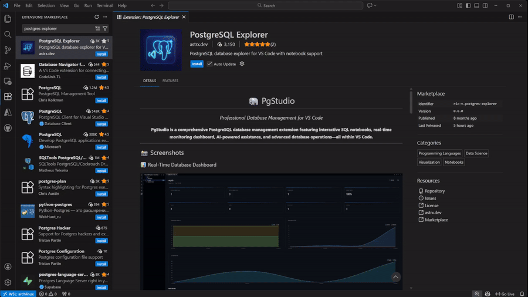
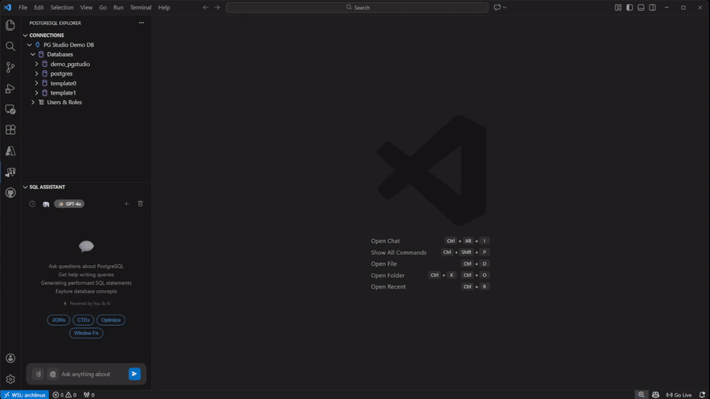

<div align="center">

# 🐘 PgStudio

### *Professional Database Management for VS Code*

[](https://marketplace.visualstudio.com/items?itemName=ric-v.postgres-explorer)
[](https://marketplace.visualstudio.com/items?itemName=ric-v.postgres-explorer)
[](https://marketplace.visualstudio.com/items?itemName=ric-v.postgres-explorer)
[](https://github.com/dev-asterix/yape)

**PgStudio** (formerly YAPE) is a comprehensive PostgreSQL database management extension featuring interactive SQL notebooks, real-time monitoring dashboard, AI-powered assistance, and advanced database operations—all within VS Code.

[📖 **Documentation**](https://pgstudio.astrx.dev/) • [🛒 **Marketplace**](https://marketplace.visualstudio.com/items?itemName=ric-v.postgres-explorer) • [🤝 **Contributing**](#-contributing)

</div>

---

## 📺 Video Guides

### 1. Setup


### 2. Database Explorer


### 3. AI Assistant Setup


### 4. AI Assistant Usage


---

## ✨ Key Features

- 🔌 **Secure Connections** — VS Code SecretStorage encryption
- 📊 **Live Dashboard** — Real-time metrics & query monitoring
- 📓 **SQL Notebooks** — Interactive notebooks with AI assistance
- 🌳 **Database Explorer** — Browse tables, views, functions, types
- 🛠️ **Object Operations** — CRUD, scripts, VACUUM, ANALYZE, REINDEX
- 🤖 **AI-Powered** — GitHub Copilot, OpenAI, Anthropic, Gemini
- 📤 **Export Data** — Export results to CSV, JSON, or Excel

---

## 🎯 Why PgStudio?

<table>
<tr>
<td width="50%">

### 🎨 Modern Interface
- Beautiful, intuitive UI designed for developers
- Real-time dashboard with live metrics
- Context-aware operations
- Seamless VS Code integration

</td>
<td width="50%">

### ⚡ Powerful Features
- Interactive SQL notebooks
- 🤖 AI-powered Copilot & agentic support
- Advanced query management
- Complete CRUD operations

</td>
</tr>
</table>

---

## 🚀 Quick Start

```bash
# Install from VS Code
ext install ric-v.postgres-explorer

# Or via command line
code --install-extension ric-v.postgres-explorer
```

Then: **PostgreSQL icon** → **Add Connection** → Enter details → **Connect!**


---

## 🏗️ Project Structure

```
yape/
├── src/
│   ├── extension.ts          # Extension entry point
│   ├── commands/             # Command implementations
│   │   ├── tables.ts         # Table operations
│   │   ├── views.ts          # View operations
│   │   ├── functions.ts      # Function operations
│   │   ├── connection.ts     # Connection commands
│   │   ├── notebook.ts       # Notebook commands
│   │   ├── helper.ts         # Shared helper utilities
│   │   ├── sql/              # SQL template modules
│   │   │   ├── tables.ts     # Table SQL templates
│   │   │   ├── views.ts      # View SQL templates
│   │   │   ├── functions.ts  # Function SQL templates
│   │   │   ├── indexes.ts    # Index SQL templates
│   │   │   └── ...           # Other SQL templates
│   │   └── ...
│   ├── providers/            # VS Code providers
│   │   ├── DatabaseTreeProvider.ts   # Tree view provider
│   │   ├── NotebookKernel.ts         # Notebook kernel
│   │   ├── ChatViewProvider.ts       # AI chat provider
│   │   ├── SqlCompletionProvider.ts  # IntelliSense
│   │   └── ...
│   ├── services/             # Business logic
│   │   ├── ConnectionManager.ts      # Connection handling
│   │   └── SecretStorageService.ts   # Credential storage
│   ├── dashboard/            # Dashboard webview
│   ├── common/               # Shared utilities
│   └── test/                 # Unit tests
├── resources/                # Icons & screenshots
├── docs/                     # Documentation & landing page
├── dist/                     # Compiled output (bundled)
├── out/                      # Compiled output (tsc)
├── package.json              # Extension manifest
├── tsconfig.json             # TypeScript config
└── webpack.config.js         # Webpack config
```

---

## 🤖 AI-Powered Operations

PgStudio integrates advanced AI capabilities directly into your workflow, but keeps **YOU** in control.

### Chat to Query (Natural Language → SQL)
Describe what you need in plain English, and PgStudio will generate the SQL for you.
- **Context-Aware**: The AI understands your table schemas and columns.
- **Smart Suggestions**: Ask for "top selling products" and it knows to join `orders` and `products`.

### 🛡️ Safe Execution Model (Notebook-First)
We believe AI should assist, not take over. **No query is ever executed automatically.**
1. **Ask**: You ask a question in the side panel.
2. **Review**: The AI generates SQL code.
3. **Insert**: You click "Open in Notebook" to place the code into a cell.
4. **Execute**: You review the code and click "Run" when you are ready.

---

## 📊 Advanced Visualizations

Turn any query result into beautiful, interactive charts in seconds.

- **One-Click Charting**: Instantly visualize your data directly from the notebook results.
- **Customizable**: Toggle between Bar, Line, Pie, Doughnut, and Scatter charts.
- **Rich Data Display**:
    - **Log Scale**: Easily analyze data with wide variances.
    - **Blur/Glow Effects**: Modern, high-fidelity chart aesthetics.
    - **Zoom & Pan**: Inspect detailed data points interactively.

---

## 🛠️ Local Development

### Prerequisites

- **Node.js** ≥ 18.0.0
- **VS Code** ≥ 1.90.0
- **PostgreSQL** (for testing)

### Setup

```bash
# Clone the repository
git clone https://github.com/dev-asterix/yape.git
cd yape

# Install dependencies
npm install

# Compile TypeScript
npm run compile
```

### Development Commands

| Command | Description |
|---------|-------------|
| `npm run watch` | Watch mode (auto-recompile) |
| `npm run compile` | One-time TypeScript compilation |
| `npm run esbuild` | Bundle with esbuild (with sourcemaps) |
| `npm run esbuild-watch` | Bundle in watch mode |
| `npm run test` | Run unit tests |
| `npm run coverage` | Run tests with coverage |
| `npm run vscode:prepublish` | Build for production |

### Running the Extension

1. Open the project in VS Code
2. Press `F5` to launch Extension Development Host
3. Or use **Run and Debug** (`Ctrl+Shift+D`) → "Run Extension"

### Debugging Tips

- **Output Panel**: `Ctrl+Shift+U` → Select "PostgreSQL Explorer"
- **DevTools**: `Ctrl+Shift+I` in Extension Development Host
- **Webview Debug**: Right-click in webview → "Inspect"

---

## 🧪 Testing

```bash
# Run all tests
npm run test

# Run with coverage
npm run coverage
```

Tests are located in `src/test/unit/` using Mocha + Chai + Sinon.

---

## 🤝 Contributing

- 🐛 [Report Bugs](https://github.com/dev-asterix/yape/issues/new?template=bug_report.md)
- 💡 [Request Features](https://github.com/dev-asterix/yape/issues/new?template=feature_request.md)
- 🔧 Fork → Branch → PR

### Commit Convention

We follow [Conventional Commits](https://www.conventionalcommits.org/):

```
feat: add new feature
fix: resolve bug
docs: update documentation
refactor: code restructuring
test: add/update tests
chore: maintenance tasks
```

---

## 📦 Building & Publishing

```bash
# Build VSIX package
npx vsce package

# Publish to VS Code Marketplace
npx vsce publish

# Publish to Open VSX
npx ovsx publish
```

---

## 📝 License

[MIT License](LICENSE)

---

<div align="center">

**Made with ❤️ for the PostgreSQL Community**

[](https://www.typescriptlang.org/)
[](https://www.postgresql.org/)
[](https://code.visualstudio.com/)

Also on [Open VSX](https://open-vsx.org/extension/ric-v/postgres-explorer)

</div>
